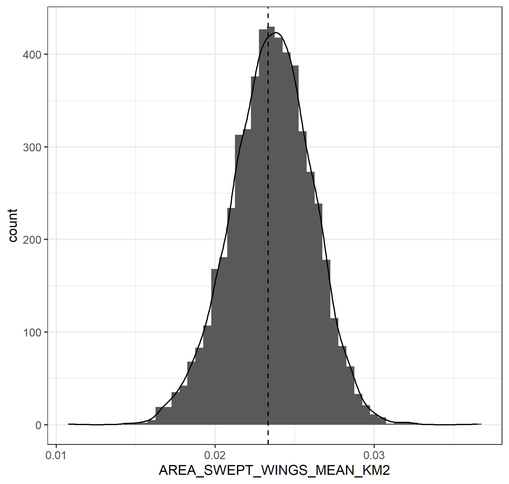
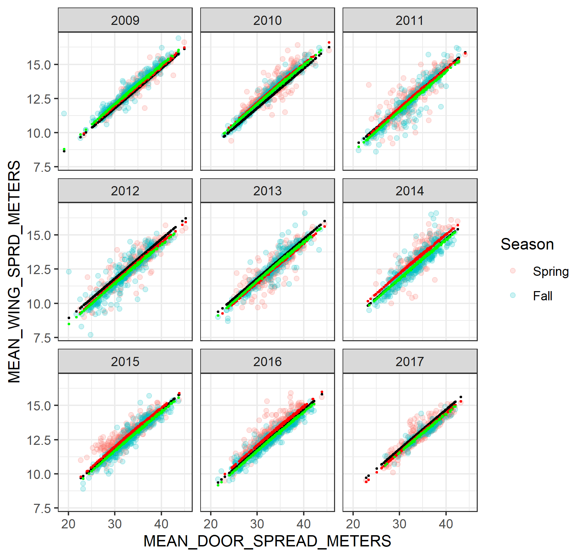
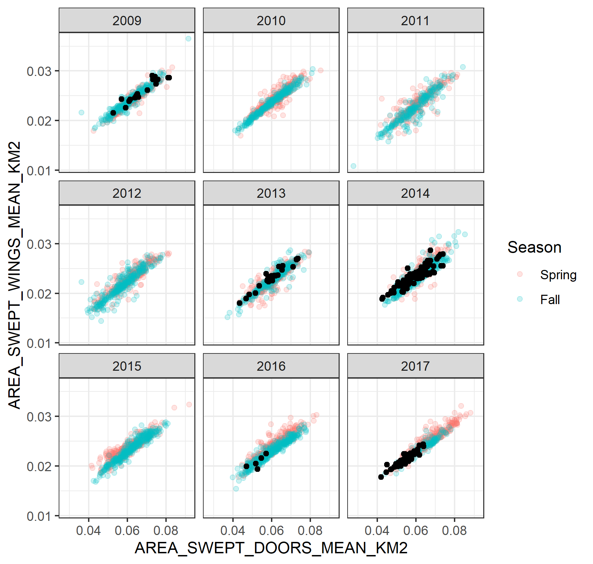
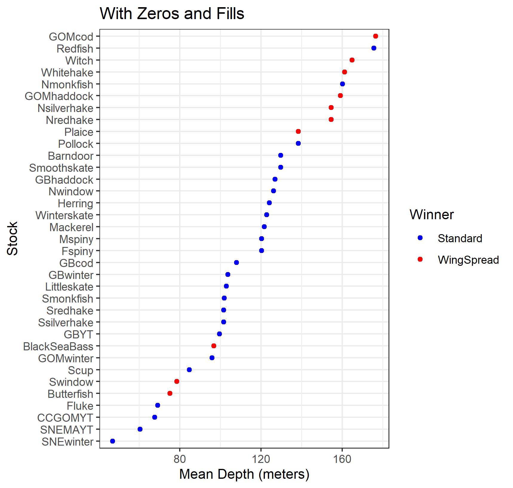
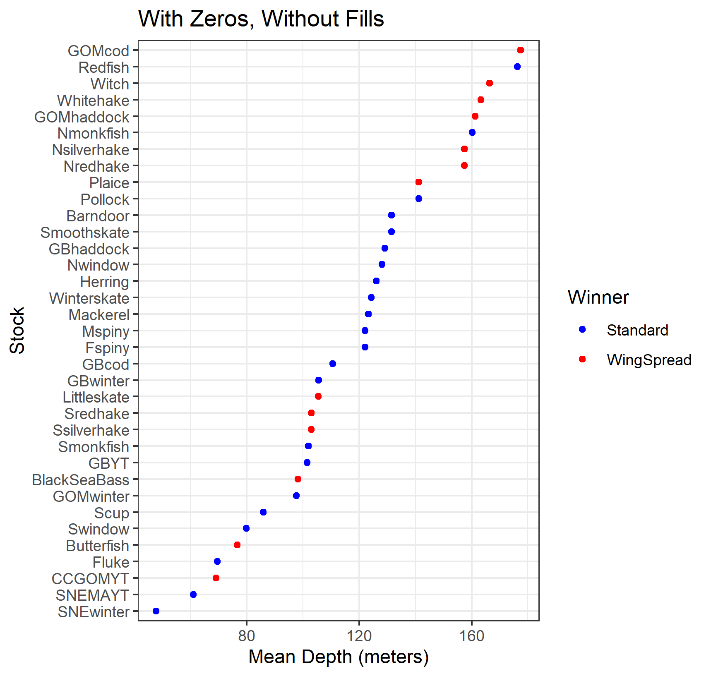
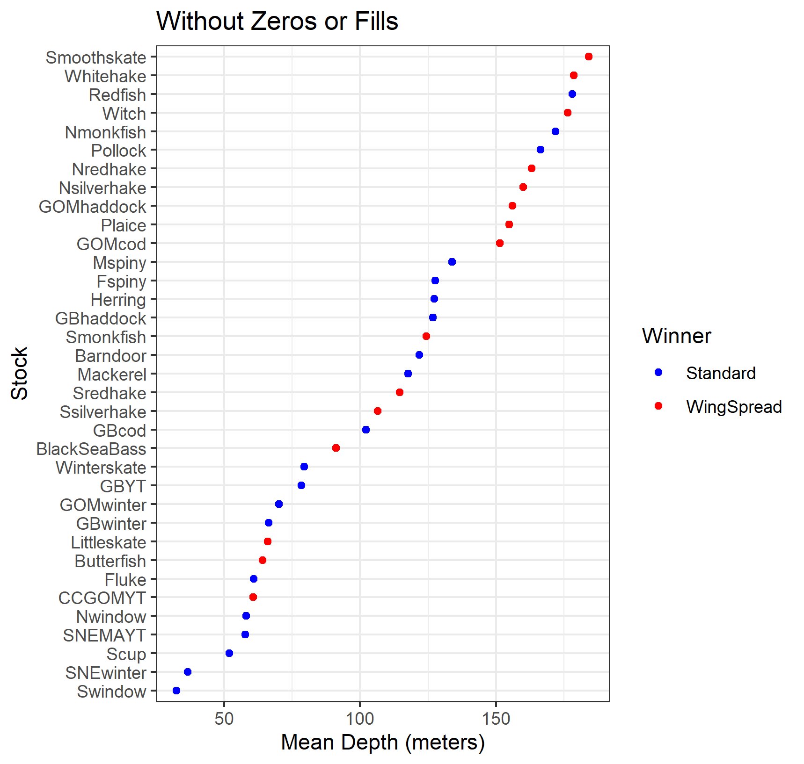

# SurveyExploration

## Overview

This README describes the work done to explore the ability to detect whether the NEFSC surveys should be computed on a per tow basis, as currently done, or adjusted to account for tow-specific area. The latter is intuitively appealing because a tow that covered a larger amount of area is expected to have a larger catch. However, the tow area is estimated based on net mensuration data and sometimes the necessary data are not available due to mechanical failures. Additionally, there is a fair amount of variability in the catch data within a survey stratum that could mask the expected relationship between tow area and catch. This work examines 35 stocks for empirical evidence to support one approach over the other.

## Bottom Line

There was not strong evidence demonstrating an increase in catch with increasing tow area. Given the large challenges associated with the catch per area approach, including how to deal with missing information, large changes in the standard software needed to estimate survey indices, and the potential need to redo the Bigelow-Albatross calibration, I recommend maintaining the catch per tow approach for computing survey indices as standard practice.

## What was done?

The GitHub site (https://github.com/cmlegault/SurveyExploration) contains all the data and code used in the analyses in the hopes that others will want to repeat and expand them. Simply download the directory to your local machine and run the code. Note you will want to set the working directory to the location of the source code first. The R code is set so that each file sources the previous file first. You can source the last file (5-make_tables_plots.r) and all the code will run. This document walks through the code file by file describing what was done and noting places where future work could be done.

### 1-load_data.r

This code loads the data into R. It also describes where the data came from and how it was derived. Importantly, the ADIOS data are in Albatross units for most stocks. These analyses could be rerun using a direct connection to Oracle to access the Bigelow data directly instead. However, in order to make these analyses repeatable, I decided to use the ADIOS data so that a connection to our databases was not required. Since most stocks use a single value to convert catch per tow (kg) on the Bigelow to Albatross units, the results are not expected to change using Bigelow data directly. Note that the adios.data.csv file loaded here is just a pointer file describing the 35 stocks and linking them to the specific ADIOS csv files that will be used later. The tow and gis data are from SAGA. Again, these data could be accessed directly through Oracle, but to make the analyses repeatable I have described the steps I took to create the csv files in SAGA. The standard wing area calculation is documented at the bottom of the file.

### 2-clean_merge_tow_data.r

First joins the tow and gis data, something that could be done in sql from Oracle instead. Now comes the fun part, cleaning up the data. A first look at the wing spread vs door spread over all tows identified a number of outliers that were removed. 


I subjectively decided on cutpoints of 0.02 and 0.01 km^2^ for door and wing area and 6 meters for door and wing spread. After cleaning up the data, the distribution of wing area swept looked quite reasonable. The vertical line in the density plot is the standard wing swept area.


But there were 504 tows that were missing wing swept area.

```  
summary(all_season$AREA_SWEPT_WINGS_MEAN_KM2)  
   Min. 1st Qu.  Median    Mean 3rd Qu.    Max.    NA's 
 0.0108  0.0219  0.0236  0.0235  0.0253  0.0365     504 
```

So need to figure out how best to fill in the data. Ran a total of 10 linear models relating wing spread to door spread and season, year, depth, and all combinations. Given the amount of data, it was not surprising that the most complex model was selected by AIC (see output/aic_table.csv for details). But there was not a lot of difference in predicted wing spread between the simplest (black) and most complex (red and green) models.


Went ahead and used the most complex model to predict wing spread and then calculate wing swept area assuming standard tow length for the 208 tows where door spread was available. The filled values are shown as the black dots in the plot. It is clear from this plot that some years have more information filled than other years using this approach. 


This left 296 tows still missing wing swept area. Simply filled these with the standard value. For details about how many missing values were filled using the door equation (DoorFill) and standard tow area (GlobalFill) compared to the tows where wing area swept was available (Measured), see output/fill_table.csv. Note that 9% tows needed fills overall, but some season, year combinations didn't need any while others required up to 36% filled.

### 3-add_stocks_data.r

This step loops through all the stocks listed in adios_dat.csv and links each catch record for each species to the tow information, resulting in 64,830 rows of data. It can take a little while to run due to the 35 stocks and large number of tows between 2009 and 2016. It also creates new variables:  
Cstandard = CatchWt / standard__wing_swept_area  
Cwingarea = CatchWt / wing_area_swept  
These are the variables that will be used in the analyses.

### 4-determine_winner.r

Four different cases were examined

Fills   | With Zeros | Without Zeros
------- | ---------- | -------------
With    | Case 1     | Case 2
Without | Case 3     | Case 4

In this table, With Fills means using the DoorFill and GlobalFill values, while Without Fills means using only the tows where wing area swept was Measured. Similarly, With Zeros means using all data collected during the survey including the zero catch tows, while Without Zeros means using only tows that caught fish in the particular stock being analyzed. It wasn't clear to me which case would be the preferred one to use, so I ran all four. You can pick the one you like the most and focus on the results from it.

For each case and stock, two linear regressions were conducted, the first using CStandard and the second using Cwingarea. The catch per area was a function of year, season, strata, and depth as follows

```
lm(Cstandard ~ as.factor(Year) * as.factor(Season) * as.factor(Strata) + wing_area_swept, data=mycase)
```

Stocks that used only one season dropped this term from the equation. Since year, season, and strata were multiplicative, this means that each combination of year, season, strata had its own intercept and only wing_area_swept determined the slope of the line for the two regressions. The test conducted was simply which regression had a slope associated with wing_area_swept that was closer to zero. A slope closer to zero would be expected for Cstandard if the variability in the system was too large to detect the expected linear increase with wing_swept_area. Using all the data for a stock at once to estimate the slope relative to wing_swept_area gave the highest precision estimate. If the two slopes, for Cstandard and Cwingarea, were equidistant from zero, a tie was declared. No ties were observed across the 140 results (35 stocks by 4 cases). See below for an example plot to see what a winner looks like.

### 5-make_tables_plots.r

The winners for each stock and case are found in output/stock_winners.csv. The total number of winners by case are

```
with(results, table(Winner, Case))  
            Case  
Winner        1  2  3  4  
  Standard   23 20 22 21  
  WingSpread 12 15 13 14  
```

So every case had more Standard winners than WingSpread winners. An Excel file (stock_winners.xlsx) is also provided in the output directory that combines the two csv files into a nicer looking table. However, none of the winners were significant as defined by the slope for the WingSpread regression was always within plus minus 1.96 times the standard error of the slope for the Standard regression.

For each stock and case, the mean depth of tows used in the analysis was computed. Plotting the winner by color relative to depth did not reveal a strong link between mean depth and which approach was preferred for any of the four cases. Note the order of the stocks changes among the four plots because each is sorted by depth.






Finally, plots of the regresion lines fit for each stock are made where each stock and year is a separate page and the season and strata are plots within the page. For some stocks, this results in plots that are too small to read easily. The code can be easily changed to look at a specific stock in more detail, but was not done here because of the large file size and long run times required (about 1.5 hours on my machine) already. An example is provided at the bottom of the file that looks at the fits to a single stock, year, season, strata. In this plot the Cstandard values are shown as blue dots and the adjusted for tow area (Cwingarea) values are shown as red dots. Note that to the left of the vertical line (the standard wing_area_swept value) the red dots are greater than the blue dots, while to the right of the vertical line the red dots are below the blue dots. The two colored lines show the respective fits. In this particular combination, the standard approach (blue) has a slope closer to zero than the tow area approach (red), meaning that adjusting the observations to account for the towed area did not produce a better fitting model. Remember that the fit is determined by all combinations of year, season, and strata for the stock, so one cannot look at just one combination and draw conclusions.


The pdf file creation is turned off by default. The user needs to change the make_pdf variable from FALSE to TRUE if they want to create the pdf files. The four files are available in the output directory with the creative names stock_specific_plots_case_[1, 2, 3, or 4].pdf. Looking through these plots one obvious result is that there is not much difference between the Cstandard (blue) and Cwingarea (red) values. When zero values are used (Cases 1 and 3), the zeros will be identical for Cstandard and Cwingarea. 

